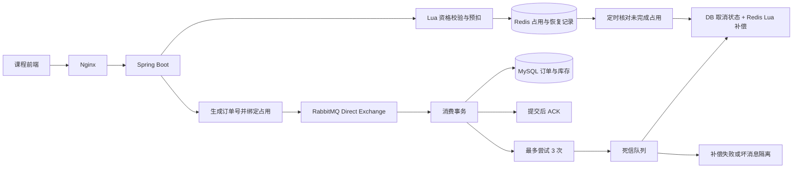
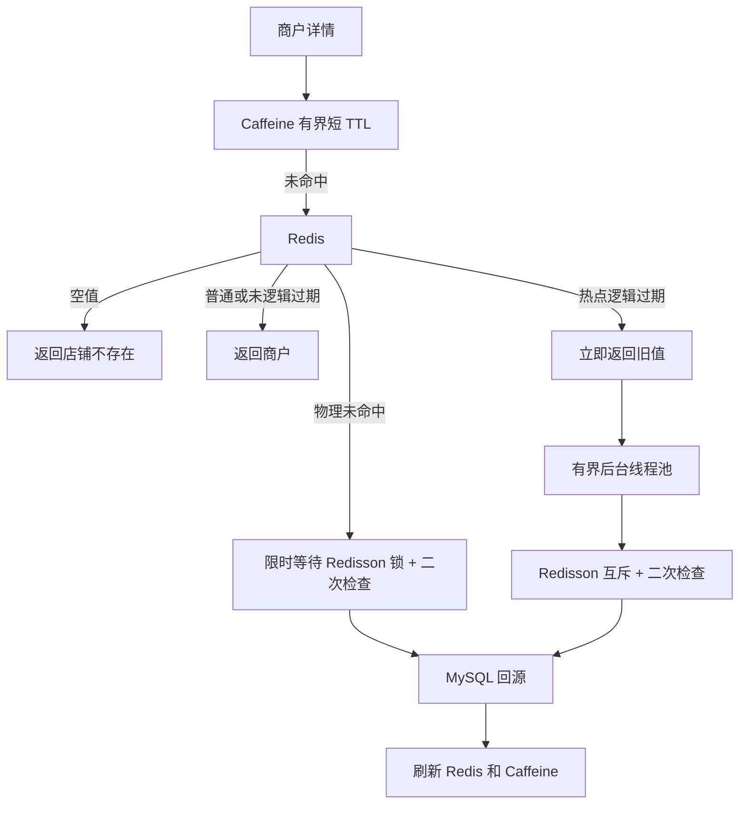
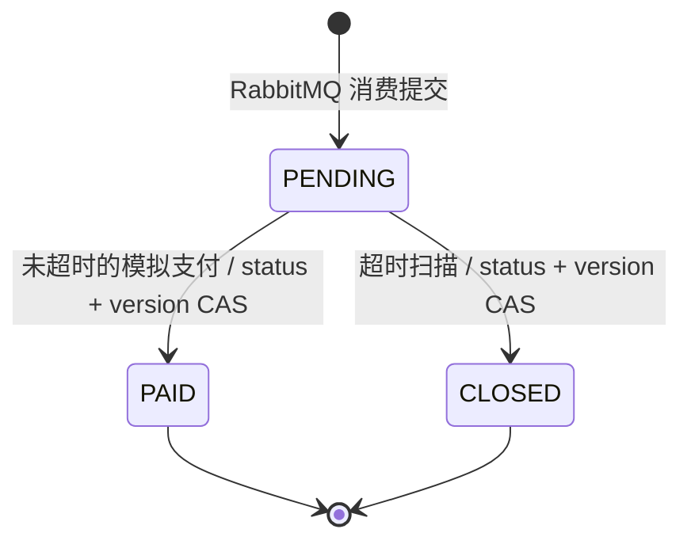
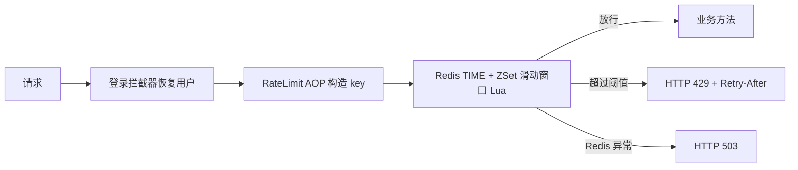
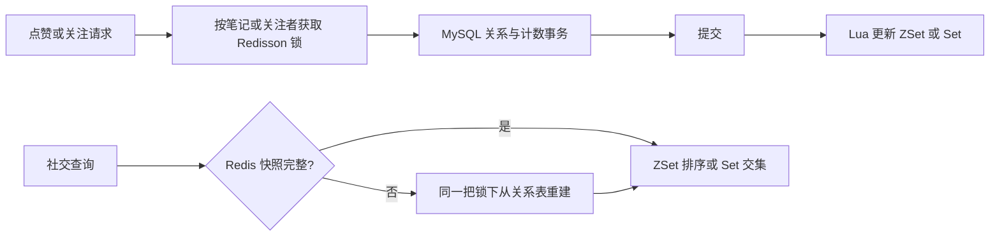

# 黑马点评二次开发

基于黑马点评开源/课程项目二次开发，M0 → M7 已完成实现与阶段验证。已在真实服务器部署并执行 JMeter：**500线程、46秒稳态窗口，入口受理999.587 TPS、P95 18ms、错误率0%**，59,425笔订单最终全部落库并完成库存核对。负载与服务同机，施压计划60秒；这是入口突发负载成绩，不是长期持续落库吞吐量。


## 技术与业务

Java 8、Spring Boot 2.7.4、MyBatis-Plus 3.5.2、MySQL 8、Redis 6.2+、Spring AMQP、RabbitMQ、Lua、Spring AOP、Caffeine 2.9.3、Redisson 3.17.7、Nginx。维持课程 baseline 的依赖版本；Caffeine 选择 Java 8 兼容的 2.x，Redisson 已用于商户缓存互斥重建。

原业务包括验证码登录、token 续期/登出、商户分类与查询、Redis 缓存、附近商户 GEO、普通券与秒杀券、探店笔记、ZSet 点赞、Set 关注和共同关注、关注推送、Bitmap 签到。验证码沿用课程模拟方式，未接入短信平台。



## 秒杀与消息可靠性

1. `seckill.lua` 使用 Redis TIME 校验 `[beginTime, endTime)`，原子判断库存和一人一单，预扣库存、保存用户资格以及本次 UUID 占用记录。不访问 MySQL，也不写 Stream。
2. Lua 成功后生成全局订单号，与占用绑定，再发布持久消息。Direct Exchange、主队列和死信队列均持久化；`mandatory + publisher returns + correlated confirms` 判断路由与发布结果。确认最长等待默认 3 秒。
3. 消费者在一个 MySQL 事务中创建订单、执行 `stock > 0` 条件扣库存并写入处理状态。订单表 `(active_user_id, voucher_id)` 唯一约束提供有效订单最终保护，关闭历史不占用资格。监听方法在事务代理返回后结束，Spring AMQP AUTO 模式此时 ACK。
4. 同一订单重投幂等成功。消费异常总共尝试 3 次，间隔 200/400ms，之后拒绝且不 requeue，由 DLX 路由 DLQ。DLQ 消费者查询数据库并协调取消，再用 Lua 补偿；三次仍失败则进入 `seckill.order.parking` 隔离队列，不无限重入主队列。
5. 发布超时不能推断消息未消费。`tb_order_delivery` 中同一订单状态行由消费和取消事务加锁：落库先提交则不释放库存；取消先提交则迟到消息不再创建订单。
6. 补偿核对 reservationId，旧消息不能释放新一次占用。Redis Hash + ZSet 保存未完成占用，进程在预扣后、发布前退出，或补偿暂时失败时，每 10 秒扫描最多 100 条进行核对。默认超过 5 分钟仍未终结的占用会取消；已落库则只清理恢复记录。

这里的 5 分钟是**异步下单完成期限**，不是未支付订单超时。排队过久的已确认消息也可能被取消；接口返回 orderId 代表接收请求，不等同于订单已经落库。落库后可查询订单并调用模拟支付接口；支付超时独立按订单 expire_time 判断。

恢复记录依赖 Redis 持久化，请开启 AOF。Redis 数据整体丢失、MySQL 数据丢失、RabbitMQ 节点永久丢盘不属于本阶段自动恢复保证。经典队列 DLX 转发存在故障丢失窗口；有效占用仍由恢复记录核对，无法保证丢失恢复记录后自动还原库存。[RabbitMQ DLX 说明](https://www.rabbitmq.com/docs/3.13/dlx)

## 启动

准备 Java 8、Maven 3、MySQL 8、Redis 6.2+、RabbitMQ。Python 3 和 mysql/redis-cli 用于开发初始化与 HTTP 验证。

### Docker Compose 基础设施

```bash
cp .env.example .env
# 编辑 .env，设置本地 MYSQL_PASSWORD、RABBITMQ_USER、RABBITMQ_PASSWORD
mkdir -p data/imgs
docker compose up -d mysql redis rabbitmq nginx
docker compose ps
```

MySQL **首次空卷启动**会依次执行 `sql/00_base.sql`、`sql/01_order_delivery.sql`、`sql/02_order_lifecycle.sql`、`sql/03_social.sql`。已有卷不会自动应用新增迁移，请按下节执行一次。

Compose `.env` 不会自动传给本机 Java；在新终端导出相同配置：

```bash
read -rs -p '本地 MySQL 密码: ' MYSQL_PASSWORD
export MYSQL_PASSWORD
export RABBITMQ_USER=hmdp
read -rs -p '本地 RabbitMQ 密码: ' RABBITMQ_PASSWORD
export RABBITMQ_PASSWORD
mvn -q -DskipTests package
java -jar target/hmdp-1.0-SNAPSHOT.jar
```

默认后端 `http://localhost:8081`、前端 `http://localhost:8080`、RabbitMQ 管理页 `http://localhost:15672`。Nginx 将 `/api/` 转发到宿主机 8081；改后端端口时同步调整 Nginx 模板上游环境变量。完整容器部署见 [deploy/README.md](deploy/README.md)。上传图片通过 `data/imgs` 挂载访问。

本次没有 Docker，真实验证使用便携 MySQL/Redis/RabbitMQ；Compose 尚未实际运行。

### 已有环境与 M1 升级

空库首次导入：

```bash
mysql -h 127.0.0.1 -u root -p -e 'CREATE DATABASE hmdp CHARACTER SET utf8mb4;'
mysql -h 127.0.0.1 -u root -p hmdp < sql/00_base.sql
mysql -h 127.0.0.1 -u root -p hmdp < sql/01_order_delivery.sql
mysql -h 127.0.0.1 -u root -p hmdp < sql/02_order_lifecycle.sql
mysql -h 127.0.0.1 -u root -p hmdp < sql/03_social.sql
```

已有 M0/M1 库依次执行 01、02、03 迁移各一次；已有 M2 库执行 02、03；已有 M3～M5 库只执行 `03_social.sql` 一次。停止应用后迁移，再启动新版本。新增唯一约束如遇重复数据会失败，先核对重复订单，迁移不会自动删数据。历史待支付订单的截止时间回填为创建时间 + 15 分钟，启动后会处理其中已超时订单。

从 M1 升级时先停止接收新秒杀，等待旧消费者清空：`XPENDING stream.orders g1` 为 0，且 `XINFO GROUPS stream.orders` 的 last-delivered-id 与 `XINFO STREAM stream.orders` 的最后记录一致。停止旧应用，再执行 SQL 并启动 M2；不要让两版下单入口并行。旧 Stream 可保留作历史记录，M2 不读取或写入它。

已有 M0～M5 环境还需在**旧应用停止、03 迁移完成、新应用启动之前**，加载正确的 MySQL/Redis 环境变量并执行：

```bash
python3 scripts/migrate-social-likes.py
```

它将旧 Redis ZSet 的已知点赞用户和时间导入关系表，保留原笔记点赞总数。关系表非空时拒绝重复导入；遇未知用户、无对应笔记或人数超过总数则停止供核对。这个脚本仅用于停流升级，不是在线修复工具。课程自带的部分点赞只有总数没有身份，不伪造用户记录。全新 MySQL/Redis 空环境无需导入旧点赞。

配置入口：`src/main/resources/application.yml`。

| 环境变量 | 默认值 / 含义 |
| --- | --- |
| `MYSQL_URL` | `jdbc:mysql://127.0.0.1:3306/hmdp?...`，完整参数见 yml |
| `MYSQL_USER` / `MYSQL_PASSWORD` | root / 空 |
| `REDIS_HOST` / `REDIS_PORT` / `REDIS_DATABASE` | 127.0.0.1 / 6379 / 0 |
| `REDIS_PASSWORD` | 空 |
| `RABBITMQ_HOST` / `RABBITMQ_PORT` | 127.0.0.1 / 5672 |
| `RABBITMQ_USER` / `RABBITMQ_PASSWORD` / `RABBITMQ_VHOST` | guest / guest / `/`；Compose 按 .env 的独立账号配置 |
| `ORDER_CONFIRM_TIMEOUT_MS` | 3000，确认等待上限 |
| `ORDER_RECOVERY_AGE_MS` | 300000，未完成占用的核对期限 |
| `ORDER_RECOVERY_DELAY_MS` | 10000，恢复扫描间隔 |
| `ORDER_PAYMENT_TIMEOUT_SECONDS` | 900，新落库订单支付有效期（秒） |
| `ORDER_CLOSE_DELAY_MS` | 10000，关单与 Redis 释放重试的扫描间隔 |
| `ORDER_CLOSE_ENABLED` | true；开发验证可关闭定时扫描 |
| `SERVER_PORT` / `UPLOAD_DIR` | 8081 / `./data/imgs` |
| `APP_LOG_LEVEL` | info；本地可设 debug 查看模拟验证码 |

## 初始化与接口

SQL 自带 14 个商户、10 个分类、4 篇笔记和普通券。附近商户索引：

```bash
python3 scripts/init-shop-geo.py
```

新增秒杀券使用 `POST /voucher/seckill`，包含 `shopId/title/subTitle/rules/payValue/actualValue/type=1/status=1/stock/beginTime/endTime`。时间为 `2026-09-13T15:00:00` 格式，按当前有效时间填写；默认时区 Asia/Shanghai。

券事务提交后预热 Redis。启动预热不覆盖现有库存；缺少库存的历史券不自动重建，应停流核对。资格 Set 保留成员 `0` 以区分完整空集合和丢失的 key，真实用户 ID 为正数。

```bash
curl -X POST 'http://localhost:8081/user/code?phone=13900000001'
redis-cli GET login:code:13900000001
curl -H 'Content-Type: application/json' -d '{"phone":"13900000001","code":"替换为验证码"}' http://localhost:8081/user/login
curl -X POST -H 'authorization: 替换为token' http://localhost:8081/voucher-order/seckill/替换为券ID
```

## 商户二级缓存

`GET /shop/{id}` 查询链路为 Caffeine L1 → Redis L2 → MySQL。仅缓存按 ID 查询的商户对象，L1 最多 10000 条、写入后 5 秒过期，返回副本以避免调用方修改共享缓存。



普通商户 L2 为兼容课程的 Shop JSON，TTL 为 1800～2100 秒；不存在的商户缓存空字符串 120 秒，不进入 L1。默认热点为商户 1，可通过 `SHOP_CACHE_HOT_IDS=1,2,3` 配置，应用重启生效。热点 L2 保存 `{data,expireTime}`（epoch 毫秒），60 秒逻辑过期，另有 300～600 秒物理 TTL 兜底。已有普通 Shop JSON 可直接读取，配置为热点后首次访问异步迁移。

逻辑过期返回旧值，由 2 个工作线程、最多 64 个排队任务重建；相同 ID 在本机只排一个任务。Redisson watchdog 保持锁租期，在同一线程 finally 释放，获取后再检查 Redis，避免并发重复回源。冷缓存最多等待锁 2 秒，超时返回失败，不无限等待或绕开锁打数据库。

`PUT /shop` 先提交 MySQL，再删除 Redis 和当前实例 Caffeine。固定 256 个本地分段读写锁使失效等待正在进行的回源/填充完成，防止旧查询结果在更新失效之后回填。回滚不删缓存；Redis 删除失败会记录日志，但仍删除 L1，后续依靠 L2 物理 TTL 自愈。热点重建失败时保留旧值，后续请求重试。

当前保证单应用实例的本地失效顺序；未实现跨实例 L1 广播。缓存允许短暂旧值，并非强一致读。Redis 整体不可用时，已有 L1 仍能命中，L1 miss 不无限制回源数据库。未提供缓存指标 HTTP 接口，命中和回源次数由专项测试验证。

| 环境变量 | 默认值 |
| --- | --- |
| `SHOP_CACHE_MAXIMUM_SIZE` / `SHOP_CACHE_L1_SECONDS` | 10000 / 5 |
| `SHOP_CACHE_TTL_SECONDS` / `SHOP_CACHE_JITTER_SECONDS` | 1800 / 300 |
| `SHOP_CACHE_NULL_SECONDS` | 120 |
| `SHOP_CACHE_HOT_IDS` | 1；逗号分隔热点商户 ID |
| `SHOP_CACHE_HOT_LOGICAL_SECONDS` / `SHOP_CACHE_HOT_PHYSICAL_SECONDS` | 60 / 300（物理 TTL 还叠加 jitter） |
| `SHOP_CACHE_LOCK_WAIT_MILLIS` | 2000 |

## 订单生命周期

订单状态沿用课程数字：`PENDING=1`、`PAID=2`、`CLOSED=4`。RabbitMQ 消费事务用数据库时间设置 `create_time`、`expire_time`（默认 15 分钟）和 `version=0`。



登录用户只能查询和支付自己的订单：

```bash
curl -H 'authorization: 替换为token' http://localhost:8081/voucher-order/替换为订单ID
curl -X POST -H 'authorization: 替换为token' http://localhost:8081/voucher-order/替换为订单ID/simulate-pay
```

异步请求刚返回时订单可能尚未落库，查询失败可稍后重试。模拟支付只改订单状态，没有真实扣款；已支付重试返回成功，不再增加版本号。数据库截止时间到达后拒绝支付，即使扫描尚未关单。

`OrderCloseTask` 每轮最多扫描 100 条超时订单，游标到尾后从头扫描。只有 `PENDING + version + expire_time` 条件更新成功的事务才恢复 MySQL 库存并插入 `tb_order_stock_release`。事务提交后执行 Lua，原子恢复 Redis 库存、移除用户资格和原占用 owner；失败项保存于 MySQL，至少 10 秒后继续重试。

Redis `seckill:closed:{orderId}` 标记使重复执行不再加库存，覆盖 Lua 成功但数据库完成标记丢失的窗口。标记不自动过期；将来归档券时应在停止重试、核对数据库释放记录后统一清理。整体 Redis 数据丢失仍需停流核对恢复，不能仅凭数据库库存在线重建。

关单后允许重新购买，因此 M3 将原 `(user_id,voucher_id)` 唯一约束改为生成列上的 `(active_user_id,voucher_id)`：关闭订单的 `active_user_id=NULL`，其他状态等于 user_id。保留关闭历史，同时仍由数据库保护一人一张有效订单；迟到的旧 RabbitMQ 消息不会再建单，旧关单重试不会释放新订单占用。

## 通用接口限流

在 Spring 管理的 public 方法上配置注解即可接入：

```java
@RateLimit(limit = 20, windowSeconds = 10, dimension = RateLimitDimension.USER)
```

支持 `API`（当前方法全局桶）、`IP`（当前方法 + 客户端 IP）、`USER`（当前方法 + 登录用户 ID）。使用类名和方法签名标识接口，URL 路径参数不另开桶；更换 token 或券 ID 不会绕过同一用户限额。USER 维度没有登录身份时返回 401。注解通过 Spring AOP 生效，同类内部自调用不经过代理，应放在对外调用的 Controller/Service 方法上。



Lua 在一次原子执行中删除窗口外成员、计数、判断阈值、添加当前请求并设置 TTL。score 使用 Redis 的毫秒时间，member 使用时间 + UUID，避免同毫秒请求覆盖。窗口为 `(now-window, now]`；拒绝请求不占名额、不延长 TTL。429 返回 `请求过于频繁` 和秒数形式的 `Retry-After`，不记录系统 ERROR。Redis 检查异常返回 503 并记录 WARN，不放行到受保护业务；并非 Redis 故障时继续无条件下单。

秒杀入口默认 `@RateLimit(limit=5, windowSeconds=10, dimension=USER)`：每用户 10 秒最多 5 次**进入业务的请求**。业务库存不足或重复下单也占用请求限额。第 6 次返回 429，不执行库存 Lua、不发布订单消息。课程前端已支持显示 429/503 的服务端提示。

`RATE_LIMIT_ENABLED` 默认 true，专用开发回归可设 false。`RATE_LIMIT_TRUSTED_PROXIES` 默认为空，IP 维度默认采用 remoteAddr；部署 Nginx 时将实际直连应用的代理 IP 配到该逗号分隔列表，支持精确 IP，不支持 CIDR。只有直连代理在名单内才读取其覆盖的 X-Real-IP；否则忽略转发头。X-Real-IP 不可用时，从 X-Forwarded-For 右侧剥离可信代理，取最近的不可信地址，无有效头则回退 remoteAddr。现有 Nginx 配置会覆盖 X-Real-IP，不需要改代理规则。

限流依赖 Redis 正常运行且共享同一数据库；Redis 数据清空或丢失会重置窗口，不宣称重启/丢数据后仍保留配额。窗口和阈值是演示规则，未来压测须区分预期 429 与业务故障。

## 社交互动

点赞使用 `blog:liked:{blogId}` ZSet，member=userId、score=点赞 epoch 毫秒。新增 `tb_blog_like` 以 `(blog_id,user_id)` 主键保存点赞身份和时间；修改关系与笔记总数在同一事务，取消点赞使用 `liked>0` 条件保护。默认返回最早点赞的 **5** 位用户，按 Redis 时间顺序批量查用户并保持顺序。

```bash
# 推荐幂等状态接口；重试同一目标状态不会再次修改计数或点赞时间
curl -X PUT -H 'authorization: 替换为token' http://localhost:8081/blog/like/替换为笔记ID/true
curl -X PUT -H 'authorization: 替换为token' http://localhost:8081/blog/like/替换为笔记ID/false
```

旧 `/blog/like/{id}` 继续保留切换语义，每次调用都切换，不能视为幂等接口。前端首页、笔记详情、关注动态已改用显式状态接口。发笔记时服务端初始化 liked/comments=0，不采纳客户端自报计数。

关注仍使用 `/follow/{id}/{true|false}`；`tb_follow(user_id,follow_user_id)` 唯一索引保证一条关系，重复关注/取关幂等，禁止关注自己或新增指向不存在用户的关系。Redis `follows:{userId}` Set 做 SADD/SREM；共同关注通过 SINTER 取交集后一次批量查用户，返回不包含内部哨兵。



Redis 成员 `0` 标记已完整加载的空集合（点赞 score=-1），不会返回给用户。数据缺失或旧格式没有标记时从关系表原子重建。快照默认 `SOCIAL_CACHE_SECONDS=300` 秒；增量写不延长整份快照寿命，以便持续有互动时也能周期校正。

Redisson watchdog 锁覆盖独立业务事务返回和 Redis 同步，避免正常并发更新乱序；MySQL 行锁与唯一约束另作持久化保护。Redis 同步失败时数据库关系保留，记录错误并尝试删除缓存，后续查询重建；删除也失败则待快照 TTL 到期。进程在 DB 提交后退出也可能短暂留下旧缓存，因此这不是跨 MySQL/Redis 的强一致事务。Redis 不可访问时无法取得社交锁，不绕过锁写入。

关注动态保留课程推送方式，读取时笔记和作者各按批次查询；同毫秒跨页 offset 累加，跳过已删除笔记，不再重复第二页。没有新增可靠消息推送或粉丝统计功能。课程只有总数但缺少身份的历史点赞会保留总数，排行榜仅返回真实已知用户；新笔记的计数与关系从零开始一致维护。

## 验证

M6 专项验证（先停止应用，完成 03 迁移）：

```bash
mvn -q -Dtest=SocialInteractionIT test
```

12 项全部通过；默认应用启动后运行 `python3 scripts/verify-m6.py`，验证真实社交 HTTP 链路。详见 [M6 记录](docs/m6-verification.md) 和 [测试摘要](docs/m6-test-results.txt)。


M5 专项验证（先停止应用，使用专用开发基础设施）：

```bash
mvn -q -Dtest=RateLimitIT test
```

10 项全部通过，覆盖三维度、可信代理、窗口恢复、100 次并发仅放行 20 次、Redis 异常及秒杀 AOP。默认配置应用启动后执行 `python3 scripts/verify-m5.py`，可复现真实下单、第 6 次 429、另一用户正常下单和窗口恢复。详见 [M5 记录](docs/m5-verification.md)。


M4 专项验证连接专用开发 MySQL/Redis/RabbitMQ，先停止应用：

```bash
mvn -q -Dtest=ShopCacheIT test
```

9 项缓存测试全部通过，包括 L1/L2/DB 路径、空值 TTL、有界容量、40 次并发冷加载/热点重建、更新提交/回滚、旧值回填竞争和失败处理。详见 [M4 验证记录](docs/m4-verification.md)。启动默认配置应用后可运行 `python3 scripts/verify-m4.py` 验证商户 HTTP 查询及更新；脚本会新增一个商户夹具。


M2 专项测试使用真实 MySQL、Redis、RabbitMQ；会新增夹具数据，并临时解绑/删除测试 Exchange。**仅在专用开发库和 vhost、且没有其他应用消费者时执行**，先停止本机 Java 应用：

```bash
mvn -q -Dtest=OrderLifecycleIT,OrderMessagingIT test
```

M3 的 8 项生命周期测试与 M2 的 13 项组合回归全部通过，详见 [M3 记录](docs/m3-verification.md) 和 [测试摘要](docs/m3-test-results.txt)。M2 的 13 项测试涵盖发布 return/nack、模拟确认丢失、事务与 ACK、有限重试/DLQ、坏消息隔离、数据库唯一约束回滚、补偿重试和并发边界。实际报告见 [m2-test-results.txt](docs/m2-test-results.txt)。

打包后的实际定时任务验证：在专用开发环境以 `ORDER_PAYMENT_TIMEOUT_SECONDS=10 ORDER_CLOSE_DELAY_MS=1000 java -jar target/hmdp-1.0-SNAPSHOT.jar` 启动，再运行 `python3 scripts/verify-m3.py`。验证后重启应用，恢复默认 15 分钟支付有效期。

应用启动后，还可执行原业务与资格回归（脚本已适配 RabbitMQ）：

```bash
python3 scripts/verify-m0.py
python3 scripts/verify-m1.py
```

M1 原始资格验证包含同用户 40 次请求，应使用 `RATE_LIMIT_ENABLED=false` 启动专用测试应用后执行；启用 M5 时这些请求会按新规则返回 429。`OrderMessagingIT` 已在自身测试配置中关闭入口限流，以隔离消息链路断言；M5 验证始终开启限流。

Python 脚本另支持 `BASE_URL`、`MYSQL_HOST`、`MYSQL_PORT`、`MYSQL_DATABASE`、`MYSQL_CLI`、`REDIS_CLI`；MySQL CLI 参数与 Java `MYSQL_URL` 分别设置。脚本会新增测试用户、券、订单、笔记，不清库。

## M7 部署与真实性能结果

[部署入口](deploy/README.md)、[JMeter执行说明](jmeter/README.md)、[服务器实际记录](docs/m7-verification.md)、[简历证据](docs/resume-evidence.md)。服务器以独立用户态方式运行 MySQL、Redis、RabbitMQ、Java 和 Nginx；另有 Compose 模板，但未实际运行镜像。

服务器 JMeter：500线程，10秒爬升，总时长60秒，到达速率设置900请求/秒；实际59,425次请求，无数据耗尽。全程受理984.656 TPS、P95 17ms、错误0%；去除爬升及调度边缘后的46秒窗口，实际线程始终500，受理999.587 TPS、P95 18ms、错误0%。达到本场入口目标（≥800TPS、P95≤300ms、错误<0.1%）。

59,425笔订单全部落库，Redis/MySQL剩余库存均40,575，资格和owner一致；队列最高采样积压30,018条，施压后约73.3秒完成排空和核对。因此不能宣称消费者实时以约1000单/秒落库，或任意持续时长都能维持这一负载。

服务与JMeter在同一真实服务器，服务CPU affinity0–7、JMeter8–11，不是独占资源；数据置于SSD。首次HDD测试暴露事务提交等待，保留持久化参数迁移SSD后复测。完整环境、参数、原始JTL压缩包、逐秒记录和失败历史均已保留。

**“使用JMeter在服务器开展500线程秒杀入口压测，60秒场景中稳态约1000TPS、P95 18ms、错误率0%，并验证异步订单最终落库与库存一致性。”** 面试时同时说明同机负载、到达速率配置和队列排空耗时。
